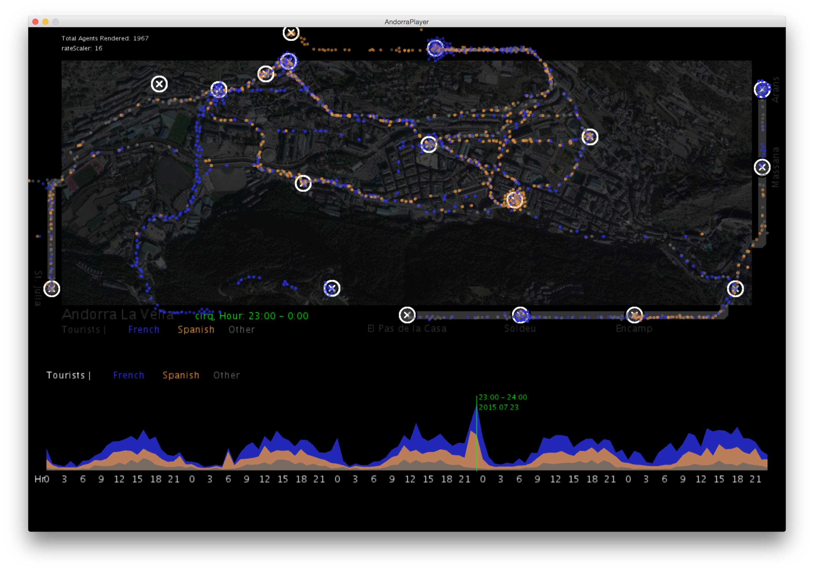

# Andorra
Scripts for agent-based visualization with origin-destination matrices with case study of Andorra CDRs.  

# Directions:
1. Download Processing (2.2.1) - https://processing.org/download/
2. You'll need the keystone library available at http://keystonep5.sourceforge.net/
3. Confirm Lastest Java is Installed https://java.com/en/download/mac_download.jsp
4. Clone The Repository
5. Run "AndorraPlayer.pde" using Processing Application

# Data Disclaimer
No record-level data exists in this repository. Any representation has been aggregated and anonymized.

## Screen Shots
* Adorra La Vella tourist activity inferred from cell phone meta data.
 

## Youtube Video
https://youtu.be/0GRgVReARt4
